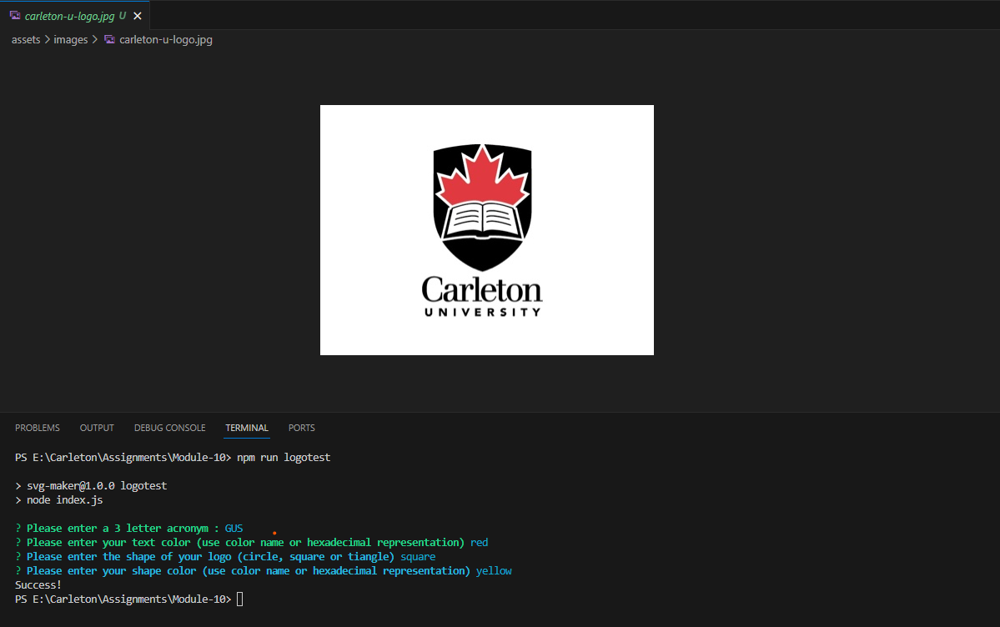
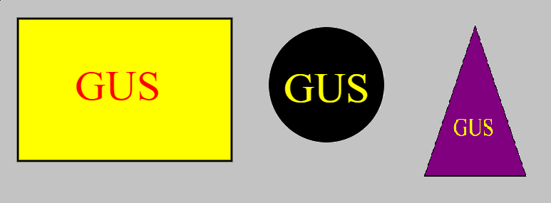

<a id="readme-top" name="readme-top"></a>

<p align="center"></p>

<p align="center" style="margin-top:25px; margin-bottom:50px;">
	<a></a>
	<a></a>
	<a></a>
	<a></a>
</p>

# Carlton Coding Bootcamp Certification

<details style="margin-bottom: 25px; margin-top: 25px;">
	<summary>Table of Contents</summary>
	<ol>
		<li><a href="#Description">Generator Description</a></li>
		<li><a href="#installation">Installation</a></li>
		<li><a href="#license">License</a></li>
		<li><a href="#usage">Application Usage</a></li>
		<li><a href="#contactme">Questions? Contact Me!</a></li>
	</ol>
</details>
<div id="Description" style="margin-top: 25px;">

## Logomania - SVG Maker

The SVG logo creator is part of the curriculum of Carleton Coding Bootcamp. The assigment was designed so that can put into practice the skill we have learned so far, including unit testing with Jest. The application was challenging in the scence that it needed to be a class-driven application, in order to be able to run the test unit.

Based on the internet this is the definition of SVG - "An SVG file is an image saved in the Scalable Vector Graphic format. The vector graphic it contains can be scaled to any size without losing quality. For this reason, digital illustrators often save logos, charts, and other graphics intended to be shown at a variety of sizes as SVG files. The World Wide Web Consortium (W3C) developed the SVG format and released its initial version in 2001." - [Fileinfo.com](https://fileinfo.com/extension/svg)

These are the prompts to create the SVG logo, currently there is only code for <span class="color:blue;">Square, Triangle and Circle</span>

<div style="margin-top: 15px;">
	
</div>

These are the shapes you can achieve with application
<div style="margin-top: 15px;">
	
</div>

</div>

<p align="right">(<a href="#readme-top">back to top</a>)</p>

<div id="installation" style="margin-top: 20px;">

## Installation

Please follow the instructions to install the Logomania CLI application

1. Clone the Logomania repository
	```js
	git clone http://github.com/gusmiller/Logomania
	```
2. Install NPM Packaged. Application uses different dependencies: chalk, email-validator, and inquirer. 
	```js
	npm install
	```
3. Install Jest - Unit testing tool (Jest package is only for developing purposes)
	```js
	npm i --global jest
	```
4. Run CLI application
	```js
	node index.js
	```
</div>

<p align="right">(<a href="#readme-top">back to top</a>)</p>

<div id="license" style="margin-top: 25px;">

## License

MIT License

Copyright (c) 2023 Logomania

Permission is hereby granted, free of charge, to any person obtaining a copy of this software and associated documentation files (the "Software"), to deal in the Software without restriction, including without limitation the rights to use, copy, modify, merge, publish, distribute, sublicense, and/or sell copies of the Software, and to permit persons to whom the Software is furnished to do so, subject to the following conditions:

The above copyright notice and this permission notice shall be included in all copies or substantial portions of the Software.

THE SOFTWARE IS PROVIDED "AS IS", WITHOUT WARRANTY OF ANY KIND, EXPRESS OR IMPLIED, INCLUDING BUT NOT LIMITED TO THE WARRANTIES OF MERCHANTABILITY, FITNESS FOR A PARTICULAR PURPOSE AND NONINFRINGEMENT. IN NO EVENT SHALL THE AUTHORS OR COPYRIGHT HOLDERS BE LIABLE FOR ANY CLAIM, DAMAGES OR OTHER LIABILITY, WHETHER IN AN ACTION OF CONTRACT, TORT OR OTHERWISE, ARISING FROM, OUT OF OR IN CONNECTION WITH THE SOFTWARE OR THE USE OR OTHER DEALINGS IN THE SOFTWARE.

<a></a>

<p align="right">(<a href="#readme-top">back to top</a>)</p>

</div>

<div id="usage" style="margin-top: 25px;">

## Application Usage

Application usage entered automatically by Lorem Ipsum. Lorem ipsum dolor, sit amet consectetur adipisicing elit. Doloribus natus iure dolorum aperiam itaque? Ipsam ad quidem quo neque aliquam natus blanditiis totam. Rerum accusantium fugit, alias numquam tenetur nemo necessitatibus laudantium officiis. Reprehenderit dolor labore iusto ut minus fugiat tempora, expedita corrupti. Ab tenetur similique ipsa dolore odio earum aliquam animi ducimus optio quibusdam ipsam eos ipsum perferendis, perspiciatis quasi temporibus. Aliquam perspiciatis dolorum est expedita quo possimus, quas temporibus pariatur mollitia debitis. Ducimus sapiente impedit culpa eos alias voluptas minima corporis veniam commodi perspiciatis. At quaerat quas porro veritatis sapiente nihil fugit cumque voluptatum voluptatem recusandae alias nulla iusto, quam exercitationem, ipsa corrupti possimus eligendi repellendus!

<p align="right">(<a href="#readme-top">back to top</a>)</p>

</div>

<div id="contactme" style="margin-top: 25px;">

## Questions? Contact Me 

The purpose of this Logomania is to help developers create a quick SVG logo file could be used in their projects. Finding a Logo is NOT the greatest priority in our developing cylce but it is something that needs to be considered. The Logomania application can be enhanced and there is space for much growth, and it is waiting for you to use your skills and imagination.

Do not hesitate in contacting me, Gustavo Miller - gustavo.miller@miller-hs.com.

You may find the application at: [https://github.com/gusmiller/Logomania](https://github.com/gusmiller/Logomania)

<p align="right">(<a href="#readme-top">back to top</a>)</p>

</div>

---
© 2023 edX Boot Camps LLC. Confidential and Proprietary. All Rights Reserved. Developed by Gustavo Miller